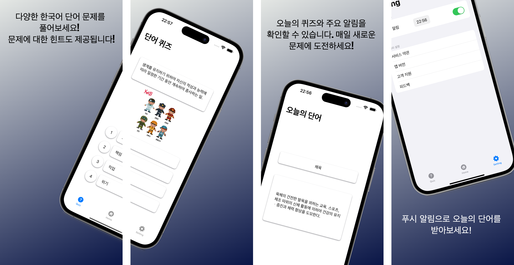

# 우리말 단어 퀴즈 - Korean Words Quiz

## 소개
우리말 단어 퀴즈 앱은 한국어 단어를 학습하고 퀴즈를 통해 재미있게 익힐 수 있는 앱입니다. 사용자는 매일 새로운 단어를 푸시 알림을 통해 받아볼 수 있으며, 다양한 퀴즈를 통해 어휘력을 향상시킬 수 있습니다.

## 기능
- **오늘의 단어**: 매일 새로운 단어를 푸시 알림으로 받아보세요.
- **퀴즈**: 다양한 한국어 단어 퀴즈를 풀어보세요.
- **설정**: 오늘의 단어 푸시 알림 설정 및 기타 앱 설정을 조정할 수 있습니다.

## 설치
앱을 설치하려면 [App Store](link_to_app_store)에서 다운로드하세요.

## 사용 방법
1. 앱을 실행하고 퀴즈 메뉴로 이동하여 다양한 퀴즈를 풀어보세요.
2. 홈 화면에서 오늘의 단어를 확인하세요.
3. 설정 화면에서 푸시 알림을 설정하여 매일 단어를 받아보세요.

### 스크린샷

## 개인정보 처리방침
우리말 단어 퀴즈 앱은 사용자의 개인정보를 수집하지 않습니다. 따라서 별도의 개인정보 처리지침이 필요하지 않습니다.

## 개발자
이 앱은 개인 개발자인 정종원에 의해 개발되었습니다.

## 문의
앱 관련 문의는 아래 이메일로 연락 주세요:
- Email: jjwon2149@gmail.com

## 기여
기여를 원하시면 Pull Request를 보내주세요. 모든 기여는 환영합니다!

### Commit Convention
- feat : 새로운 기능 추가
- fix : 버그 수정
- docs : 문서 수정
- style : 코드 포맷팅, 세미콜론 누락, 코드 변경이 없는 경우
- refactor : 코드 리펙토링
- test : 테스트 코드, 리펙토링 테스트 코드 추가
- chore : 빌드 업무 수정, 패키지 매니저 수정**
