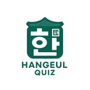
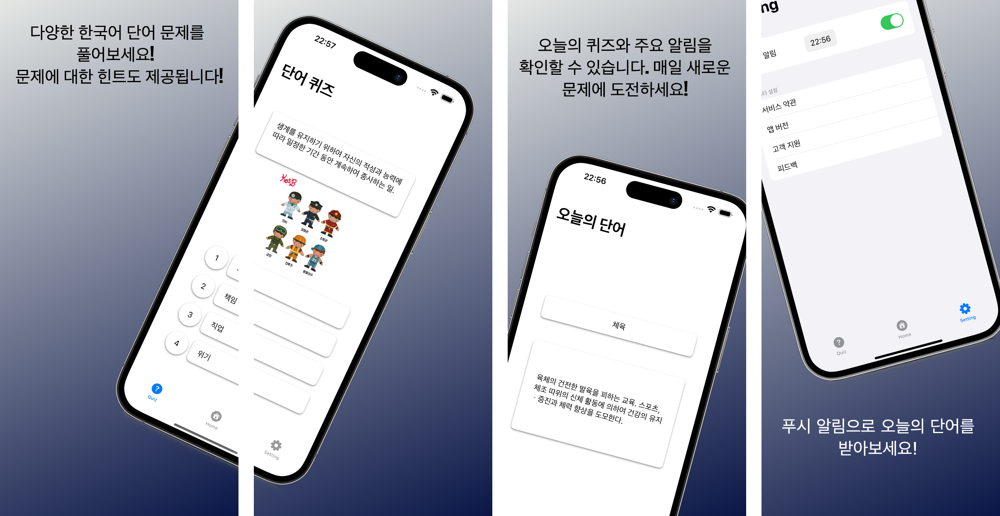

# 우리말 단어 퀴즈 - Korean Words Quiz

## 소개

우리말 단어 퀴즈는 한국어 단어를 매일 확인하고 퀴즈로 복습하는 iOS 앱입니다. 현재 앱의 핵심 흐름인 오늘의 단어, 단어 퀴즈, 알림 설정을 유지하면서, MVP 개선 방향은 외국인 한국어 학습자가 단어의 의미와 사용 맥락을 더 쉽게 이해하도록 돕는 것입니다.

외국인 학습자용 MVP는 서버 연동 없이 앱에 포함된 로컬 학습 데이터를 기준으로 동작하는 것을 원칙으로 합니다. 단어별 영어 뜻, 쉬운 한국어 설명, 로마자 표기, 예문, 난이도, 오답 피드백을 제공해 네트워크 상태와 관계없이 기본 학습 경험을 보장하는 것이 목표입니다.

## MVP 개선 방향

- **대상 사용자**: 한국어 어휘를 배우는 외국인 학습자
- **데이터 정책**: 원격 서버, CMS, 원격 DB 연동은 MVP 범위에서 제외하고 앱 번들 또는 로컬 코드 기반 데이터를 사용합니다.
- **학습 콘텐츠**: 한국어 단어, 영어 뜻, 쉬운 한국어 설명, 로마자 표기, 품사, 난이도, 예문, 예문 번역, 오답 피드백을 단어 단위로 관리합니다.
- **기존 기능 유지**: 오늘의 단어, 퀴즈, 알림 설정 흐름은 제거하지 않고 학습자용 데이터로 보강합니다.
- **네트워크 의존도 축소**: 사전/이미지 API 호출 여부와 관계없이 핵심 단어 설명과 퀴즈가 표시될 수 있어야 합니다.

## 기능

- **오늘의 단어**: 매일 하나의 한국어 단어와 학습자용 설명을 확인합니다.
- **퀴즈**: 한국어 단어의 뜻과 예문을 바탕으로 객관식 퀴즈를 풉니다.
- **오답 피드백**: MVP에서는 틀린 선택지에 대해 쉬운 설명과 복습 힌트를 제공하는 방향으로 개선합니다.
- **알림**: 오늘의 단어를 잊지 않도록 알림 설정 흐름을 유지합니다. MVP의 알림 콘텐츠는 로컬 학습 데이터에서 가져오는 것을 기준으로 합니다.
- **다국어 문구**: 기존 한국어, 영어, 일본어 리소스를 유지하면서 외국인 학습자용 라벨과 피드백 문구를 추가합니다.

## 로컬 학습 데이터 필드

MVP 단어 데이터는 오늘의 단어, 퀴즈, 알림이 같은 콘텐츠를 재사용할 수 있도록 공통 모델로 관리합니다.

| 필드 | 용도 |
| --- | --- |
| `id` | 단어를 안정적으로 식별하는 고유 값 |
| `korean` | 화면과 퀴즈에 표시할 한국어 단어 |
| `romanization` | 한글을 아직 빠르게 읽기 어려운 학습자를 위한 로마자 표기 |
| `partOfSpeech` | 명사, 동사, 형용사 등 품사 정보 |
| `difficulty` | beginner, intermediate, advanced 등 난이도 구분 |
| `englishMeaning` | 가장 짧고 명확한 영어 뜻 |
| `easyKoreanDefinition` | 초급 학습자가 이해하기 쉬운 한국어 설명 |
| `exampleKorean` | 실제 사용 맥락을 보여주는 한국어 예문 |
| `exampleEnglish` | 예문의 영어 번역 |
| `incorrectFeedback` | 퀴즈 오답 시 보여줄 복습 힌트 또는 피드백 |

자세한 MVP 범위와 샘플 데이터 형식은 [외국인 학습자 MVP 문서](docs/foreign-learner-mvp.md)를 참고하세요.

## 설치

앱을 설치하려면 [App Store](https://apps.apple.com/kr/app/%EC%9A%B0%EB%A6%AC%EB%A7%90-%EB%8B%A8%EC%96%B4-%ED%80%B4%EC%A6%88-korean-words-quiz/id6505052767)에서 다운로드하세요.

## 사용 방법

1. 앱을 실행하고 홈 화면에서 오늘의 단어를 확인합니다.
2. 퀴즈 메뉴에서 단어 뜻과 예문을 바탕으로 객관식 퀴즈를 풉니다.
3. 설정 화면에서 알림을 켜 매일 단어 학습을 이어갑니다.

### 스크린샷

## 개발 문서

- [문서 인덱스](docs/README.md)
- [외국인 학습자 MVP 범위](docs/foreign-learner-mvp.md)
- [현재 구조 분석](docs/foreign-learner-mvp-analysis.md)
- [리뷰어 QA 체크리스트](docs/qa/foreign-learner-mvp-checklist.md)

## 개인정보 처리방침

우리말 단어 퀴즈 앱은 사용자의 개인정보를 수집하지 않습니다. 외국인 학습자용 MVP에서도 학습 콘텐츠는 로컬 데이터 기반으로 제공하며, 계정, 원격 학습 기록, 서버 기반 개인화는 범위에 포함하지 않습니다.

## 개발자

이 앱은 개인 개발자인 정종원에 의해 개발되었습니다.

## 문의

앱 관련 문의는 아래 이메일로 연락 주세요.

- Email: jjwon2149@gmail.com

## 기여

기여를 원하시면 Pull Request를 보내주세요. 모든 기여는 환영합니다.

### Commit Convention

- feat: 새로운 기능 추가
- fix: 버그 수정
- docs: 문서 수정
- style: 코드 포맷팅, 세미콜론 누락, 코드 변경이 없는 경우
- refactor: 코드 리펙토링
- test: 테스트 코드, 리팩토링 테스트 코드 추가
- chore: 빌드 업무 수정, 패키지 매니저 수정
